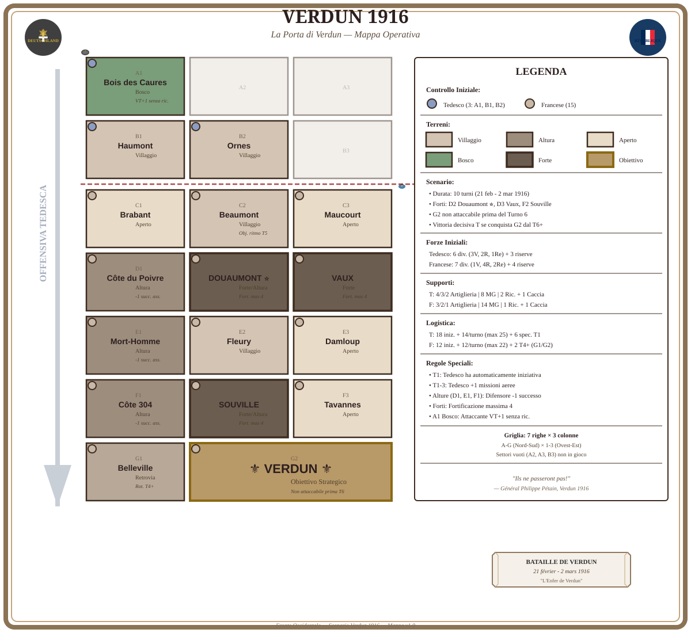

# Fronte Occidentale

A bilingual digital rulebook and scenario-map toolkit for an operational wargame set during the First World War. The project combines the complete game rules, historical scenarios, victory conditions, printable player aids, worked examples, and browser-based editing tools.

**Live rulebook:** the current version of the rules is deployed at [paulvern.free.nf/Verdun](https://paulvern.free.nf/Verdun).



## Features

- complete rulebook in Italian and English;
- dynamic table of contents with chapter-by-chapter navigation;
- one-click loading of the complete manual;
- responsive layout for desktop, tablet, and mobile devices;
- dedicated print stylesheet and browser PDF export;
- password-protected TipTap editor for rulebook content;
- automatic HTML backups before existing sections are changed;
- visual tools for chapters, tables, images, rule boxes, examples, and page breaks;
- two Leaflet-based editors for building operational scenario maps;
- SVG scenario maps and local SQLite scenario storage.

## Included scenarios

| Scenario | Year | Content |
| --- | ---: | --- |
| Verdun | 1916 | Scenario and victory conditions |
| Isonzo | 1916 | Scenario and victory conditions |
| Messines | 1917 | Scenario and victory conditions |
| Cambrai | 1917 | Scenario and victory conditions |
| Passchendaele | 1917 | Scenario and victory conditions |
| Chemin des Dames | 1917 | Scenario and victory conditions |
| Piave | 1918 | Scenario and victory conditions |

## Main components

| Entry point | Purpose |
| --- | --- |
| `index.html` | Public bilingual rulebook reader and print/PDF interface |
| `admin.php` | Password-protected visual editor for the HTML rulebook sections |
| `editoretto.php` | Main bilingual scenario-map editor with a desktop-style interface |
| `editorettoe.php` | Classic English scenario-map editor with a fixed sidebar |
| `editoretto.html` | Standalone experimental map-editor prototype |

## Quick start: rulebook reader

The reader loads its chapters with `fetch()`, so opening `index.html` directly from the filesystem is not sufficient. Start a small HTTP server from the project directory.

With Python:

```bash
python -m http.server 8000
```

On Windows, this command may also be used:

```powershell
py -m http.server 8000
```

Then open [http://localhost:8000](http://localhost:8000).

This mode is sufficient for reading and printing the manual. PHP is required for the rulebook editor and for persistent scenario-map storage.

## PHP setup

The complete toolkit requires:

- PHP 7.4 or later;
- PHP `session` and `fileinfo` support for the rulebook editor;
- the PHP `PDO` and `pdo_sqlite` extensions for the scenario-map editors;
- Internet access for TipTap, Leaflet, html2canvas, geocoding, and online map layers;
- write permission on the content, backup, upload, and database paths used by the editors.

Start PHP's built-in development server:

```bash
php -S 127.0.0.1:8000
```

Useful addresses:

- rulebook: [http://127.0.0.1:8000/](http://127.0.0.1:8000/);
- rulebook editor: [http://127.0.0.1:8000/admin.php](http://127.0.0.1:8000/admin.php);
- main scenario editor: [http://127.0.0.1:8000/editoretto.php](http://127.0.0.1:8000/editoretto.php);
- classic scenario editor: [http://127.0.0.1:8000/editorettoe.php](http://127.0.0.1:8000/editorettoe.php);
- rulebook diagnostics: [http://127.0.0.1:8000/check-editor.php](http://127.0.0.1:8000/check-editor.php).

The built-in PHP server is suitable for local development only. Use a properly configured Apache or Nginx installation for deployment.

## Rulebook editor

`admin.php` provides a TipTap-based interface for editing the files referenced by `manual.json` and `manual_en.json`. It supports both languages and can:

- load and save existing sections;
- create, rename, reorder, and remove chapters;
- format headings, paragraphs, lists, links, and tables;
- insert rule, example, historical, warning, and procedure boxes;
- insert images and page breaks;
- preview a section before saving it.

Saving an existing section first copies its previous HTML to `backups/`.

### Configure the editor password

Before deploying the project, generate a new password hash:

```bash
php -r "echo password_hash('choose-a-strong-password', PASSWORD_DEFAULT) . PHP_EOL;"
```

Replace `EDITOR_PASSWORD_HASH` in `editor-config.php` with the generated value. Only the password hash should be committed; never commit the plaintext password.

## Scenario-map editors

Both PHP map editors are single-file Leaflet applications with the same SQLite backend. They are intended to create the operational maps used by the scenarios rather than edit the prose of the rulebook.

### Map-building tools

The editors allow the user to:

- search for a theatre of operations through OpenStreetMap Nominatim;
- add hexagonal sectors by clicking the map or using **Hex at Centre**;
- drag sectors to new geographic positions;
- edit each sector's code and name;
- assign a belligerent and a historically styled flag;
- assign a terrain or infrastructure symbol;
- create or remove dashed links between sectors;
- change the physical hex radius from 200 to 2,500 metres;
- adjust map opacity, label font, label size, and flag size;
- clear the current map and start a new scenario.

Available sector symbols include height, fort, city, karst, river, trench, woods, bridge, and railway. The nationality list covers the principal First World War powers represented by the project, plus a neutral/unassigned state.

### Available basemaps

| Provider | Source |
| --- | --- |
| Vintage topographic map | OpenTopoMap |
| Standard street map | OpenStreetMap |
| IGM 1:25,000 | Italian PCN/Geoportal WMS, HTTP and HTTPS variants |
| 1988 black-and-white orthophoto | Italian PCN/Geoportal WMS, HTTP and HTTPS variants |
| État-Major historical map | IGN/Geoportail France |
| Satellite imagery | Esri World Imagery |

The built-in WMS diagnostic reports the selected PCN endpoint, map file, layer name, HTTP response, and whether the requested layer appears in `GetCapabilities`.

### `editoretto.php`: main editor

This is the recommended and more feature-complete interface. It adds:

- English and Italian UI translation;
- desktop-style menus and a quick toolbar;
- draggable, minimisable, and hideable floating windows;
- separate panels for sectors, saved scenarios, cartography, labels, and the flag legend;
- persistence of interface language and floating-window positions in `localStorage`;
- restoration of the saved interface layout together with the scenario.

### `editorettoe.php`: classic editor

This variant exposes the same core map, sector, linking, SQLite, WMS, and PNG-export logic through a simpler English-only interface. Controls are placed in a fixed left sidebar, while the editable sector list appears in a collapsible bottom panel.

It can read scenarios created by the main editor because both variants use the same database schema and core JSON state. Main-editor-only preferences, such as language and floating-window layout, are simply not used by the classic interface.

### Saving and loading scenarios

The editors create a `saved_maps` SQLite table with the following data:

- scenario title;
- Base64 PNG preview;
- JSON editing state;
- creation timestamp.

The JSON state preserves the sectors, manual links, map centre, zoom, map provider, opacity, hex radius, and label settings. `editoretto.php` also saves the active language and floating-window layout.

The saved-scenario panel lists the 100 most recent entries and allows each scenario to be reopened or permanently deleted.

### Database filename note

Both PHP editors currently point to:

```php
$db_file = __DIR__ . '/ww1_wargame_maps.sqlite';
```

The supplied project archive instead contains `mappe_wargame.sqlite`. If the project directory is writable, the editors will create a new `ww1_wargame_maps.sqlite` automatically. To use the supplied database, either rename it to `ww1_wargame_maps.sqlite` or change `$db_file` in both PHP files so that the names match.

Because each save includes a Base64 PNG preview, the database can grow quickly. Keep periodic backups and remove obsolete scenario versions when they are no longer needed.

### Exporting and printing scenario maps

Both editors export the visible map as a PNG at double canvas scale through html2canvas. Leaflet controls and editing highlights are hidden during capture.

There is currently no dedicated `window.print()` command or direct PDF export in either scenario editor. To print a scenario:

1. frame the desired area and select the final basemap;
2. choose **Export PNG**;
3. open the downloaded image in an image viewer or document editor;
4. print it or convert it to PDF from that application.

PNG capture depends on cross-origin access to every visible map tile. Some WMS or tile providers may block canvas export because of CORS, mixed HTTP/HTTPS content, certificate errors, or temporary service availability. If export fails, try an HTTPS provider or a different basemap.

## Editing rulebook content manually

The two manifests define the version, order, numbering, title, and source file of every chapter:

- `manual.json` for Italian;
- `manual_en.json` for English.

Each item in `sections` follows this structure:

```json
{
  "id": "verdun",
  "number": 15,
  "title": "Scenario: Verdun 1916",
  "file": "sections/16-scenario-verdun.html"
}
```

The chapters are ordinary HTML fragments stored in `sections/` and `sections_en/`. To add one manually:

1. create its HTML file in the appropriate language directory;
2. add its entry to the corresponding manifest;
3. assign a unique `id`;
4. check its order and numbering in the generated table of contents.

## Printing the complete rulebook

Select **Load All**, followed by **Print / PDF**. The reader loads every chapter in sequence and opens the browser print dialog, where **Save as PDF** can be selected.

For consistent output:

- enable background graphics;
- use default or minimum margins;
- inspect tables, maps, and page breaks in the print preview.

## GitHub Pages deployment

The public reader is static and can be hosted with GitHub Pages. In the repository settings, select the desired branch and the repository root as the Pages source.

> GitHub Pages does not run PHP. The public rulebook reader will work, but the rulebook editor, persistent scenario storage, and the PHP map editors require separate PHP hosting.

## Project structure

```text
.
├── index.html                   # Public rulebook reader
├── manual.json                  # Italian chapter manifest
├── manual_en.json               # English chapter manifest
├── sections/                    # Italian chapters
├── sections_en/                 # English chapters
├── assets/
│   ├── css/manual.css           # Screen and print styles
│   ├── js/                      # Rulebook reader and editor modules
│   └── img/manual/              # Uploaded images and SVG maps
├── admin.php                    # Rulebook editor login and interface
├── api-editor.php               # Rulebook read/write API
├── editor-config.php            # Sessions, paths, and authentication
├── editoretto.php               # Main bilingual scenario-map editor
├── editorettoe.php              # Classic scenario-map editor
├── editoretto.html              # Experimental static map editor
├── mappe_wargame.sqlite         # Supplied scenario database
├── backups/                     # Automatic rulebook-section backups
└── plans/                       # Design notes and consistency reports
```

## Security before deployment

Before exposing any editor on the Internet:

1. set a new, strong password for the rulebook editor;
2. serve the application exclusively over HTTPS;
3. restrict access to the administration and API endpoints at the web-server level;
4. deny web access to `backups/`, including on servers that do not process `.htaccess` files;
5. remove development and diagnostic scripts such as `debug.php`, `debuggo.php`, `genera.php`, `ping.php`, and `check-editor.php` from the public deployment;
6. give the PHP process write access only to the files and directories it must modify;
7. protect `editoretto.php` and `editorettoe.php`: they currently have no application-level authentication or CSRF protection;
8. protect the SQLite database from direct download and include it in the backup policy.

The root `.htaccess` contains Apache directives that disable caching for editable content. Equivalent rules must be configured manually when using Nginx or another server.

## External services and dependencies

- [TipTap](https://tiptap.dev/) 2.11.5 for the rulebook editor;
- [Leaflet](https://leafletjs.com/) 1.9.4 for interactive maps;
- [html2canvas](https://html2canvas.hertzen.com/) 1.4.1 for PNG capture;
- OpenStreetMap Nominatim for place search;
- OpenTopoMap, OpenStreetMap, PCN/Geoportal, IGN/Geoportail, and Esri for basemap imagery;
- PHP and SQLite for server-side persistence.

Production deployments should review each external provider's availability, attribution, usage, and rate-limit requirements.

## Current project notes

- both manifests identify the rulebook as version **v1.0**;
- `index.html` still contains a `v0.9.5` document title, while its footer reports `v1.0`;
- the scenario editors expect `ww1_wargame_maps.sqlite`, while the supplied file is named `mappe_wargame.sqlite`;
- scenario printing is performed through PNG export rather than a dedicated print view;
- the project is designed for continuing playtest and editorial revision.

Before creating a release, align the displayed version strings, verify both language editions, test every scenario, check the rulebook PDF layout, and confirm PNG export with the selected basemap provider.

## License

The project does not currently include a `LICENSE` file. Before public distribution or accepting contributions, add a licence that separately clarifies the permitted use of the source code, written content, maps, and images.
